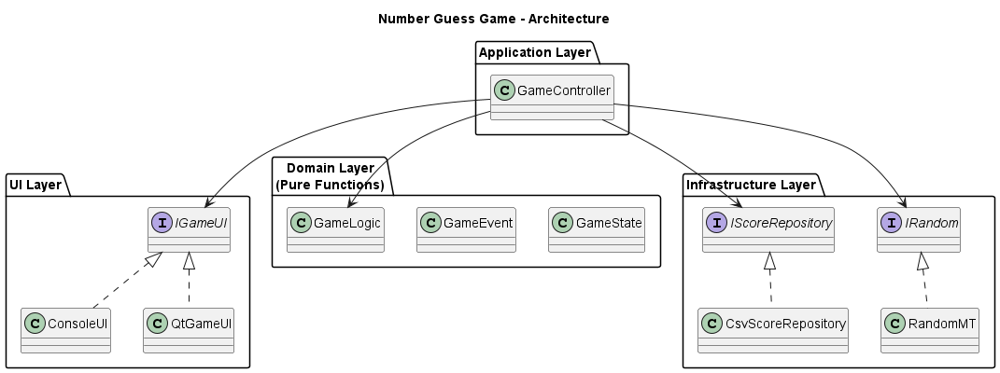
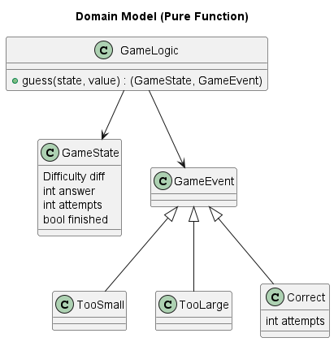
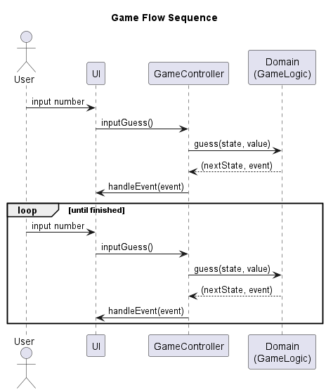

# Number Guess Game (C++)

## Overview
A C++ number guessing game designed to demonstrate
advanced software design and testability.

## Architecture
- Domain layer is fully independent from UI and infrastructure.
- State pattern is used to manage game states (Playing / Finished).
- Dependency Injection enables mocking and testing.

## Structure
- domain: core game rules
- app: application control logic
- infra: random generation and persistence
- ui: console / Qt UI implementations

## Testing
- GoogleTest with mocked Random and UI components
- Domain and controller logic are fully testable

## Build
```bat
mkdir build
cd build
cmake -G "MinGW Makefiles" ..
cmake --build .
ctest
```

## Logic View
```bat
+-------------+       +----------------+
|   Console   |       |     Qt UI      |
|     UI      |       |                |
+------+------+       +--------+-------+
       |                        |
       v                        v
+--------------------------------------+
|            Application                |
|          (GameController)             |
+--------------------------------------+
                    |
                    v
+--------------------------------------+
|              Domain                  |
|  GameState + GameEvent + GameLogic   |
|     (Pure Functions / No I/O)        |
+--------------------------------------+
```

## Game Flow
```bat
User
 │
 │ guess number
 ▼
UI
 │
 │ inputGuess()
 ▼
GameController
 │
 │ guess(state, value)
 ▼
Domain (pure)
 │
 │ returns (nextState, event)
 ▼
GameController
 │
 │ handleEvent(event)
 ▼
UI
```


## Architecture Overview



This diagram shows the layered architecture of the application.
The domain layer is completely independent from UI and infrastructure.

---

## Domain Model (Pure Functions)



The domain consists only of immutable state and pure functions.
No I/O or framework dependency exists in this layer.

---

## Game Flow (Sequence Diagram)



Each user action produces a new state and a domain event,
which is handled by the UI in an event-driven manner.


### Design Highlights
- Domain logic is implemented as pure functions.
- No class in the domain layer performs I/O or holds mutable state.
- State transitions are explicit and represented as value transformations.
- The same domain logic is reused by Console UI, Qt UI, and unit tests.


## Design Documentation

This project includes UML diagrams written in PlantUML
to clearly describe the architecture and design decisions.

- `docs/uml/architecture.puml` : Overall layered architecture
- `docs/uml/domain.puml`       : Domain model (pure functions)
- `docs/uml/sequence_game.puml`: Game flow sequence

These diagrams reflect the clean architecture and
immutable, event-driven domain design.


## Design Evolution

This project intentionally evolved through multiple design stages
to improve testability, clarity, and architectural cleanliness.

### Phase 1: Object-Oriented Design (Class-based State Pattern)
- Game logic implemented with classes and virtual state objects.
- State transitions handled via inheritance and polymorphism.
- Issues:
  - Tight coupling between domain logic and behavior.
  - vtable dependencies and linker complexity.
  - Harder to reason about state transitions.

### Phase 2: Variant-based State Machine
- Replaced virtual inheritance with `std::variant`.
- State handled as value types instead of polymorphic objects.
- Benefits:
  - Compile-time exhaustiveness checking.
  - Removal of vtable and runtime polymorphism.
  - Clearer state transitions.

### Phase 3: Pure Functional Domain (Final Design)
- Domain logic rewritten as pure functions.
- Game state represented as immutable value objects.
- Each user action produces:
  - A new game state
  - A strongly-typed domain event (`std::variant`)
- Results:
  - Deterministic and fully testable domain logic.
  - No dependency on UI, I/O, or frameworks.
  - Same domain reused by Console UI, Qt UI, and unit tests.

This evolution demonstrates deliberate architectural decision-making
rather than accidental complexity.